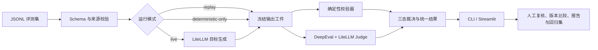

# 基于 DeepEval 的通用 LLM 质量评测工作台 POC

状态：Scientific v2 正式匿名矩阵与机器最终报告已完成  
版本：v2.2  
日期：2026-08-04  
项目类型：个人可复现 POC  
公开名称：Minos Bench（米诺斯审判台）  

> 本文是项目的产品与实施权威。截至 2026-08-04，Scientific v2 已把 V1 的 25 道低区分度题降级为历史冒烟/回归证据，并冻结 24 道全新正式题：四类任务各 6 题、12 个风险格、每格一题 D2 与一题 D3。活动矩阵固定为 4 次最小 Provider probe、96 次目标生成和 96 次单次原子 Judge；空/不完整响应和 API 运行失败可恢复，已有非空答案即使内容错误也绝不因质量重跑。正式矩阵及派生恢复已经完成，最终为 96/96 目标输出、96/96 合法 Judge 和 0 个运行错误。

> Scientific v1 的派生恢复与机器最终报告继续作为历史工程证据：`scientific-v1-20260804-v17-recovery-a` 达到 227/227 节点、100/100 目标输出、100/100 Judge 结果和 14/14 Judge 固定体检。该历史结论只适用于 V1 题集、规则和单 Judge，不等于客观真值、生产效果或通用模型排名。

> **2026-08-02 最终产品方案：**现有 40/8、G-Eval、旧阈值、重复次数和旧三组矩阵只代表工程基线。候选人逐项批准的 v3 采用能力风险矩阵、直接核验/风险提示分权、原子语义初审、候选人参考判断、五类数据用途、四配置控制实验和参考总分。正式执行允许主动一键跑完预先冻结的有限矩阵；每配置每题生成一次、每答案评分一次，不做波动实验，不设累计请求/Token 门禁，但禁止质量触发重生成、自动扩张矩阵或自动新建下一轮。详见 `docs/SCIENTIFIC_EVALUATION_IMPLEMENTATION_PLAN_V3_APPROVED.md`。

> **当前阶段入口：**先读 `docs/PROJECT3_CURRENT_STATUS_20260802.md`。V2 机器最终报告和匿名包已经生成；人工抽检为可选审计。只有空/API/输出合同运行失败节点允许恢复，内容错误和已有合法 Judge 结果不重跑。此前无逐题出处的 16 道演示题继续排除。

当前可核验里程碑：

- Scientific v2 已封印 24 道正式比较题，四类任务各 6 道；12 个风险格各含一个 D2 和一个 D3 独立场景。manifest SHA-256 为 `3cd5c60f3aae6d57c2622409ad8b4946f66e80506da75a6c25e474247ee18efc`，seal SHA-256 为 `4c610a10c3f8667fbfafd9f343256efa9b1ac944b93209ddc4f3f5bf5da4387a`；
- V2 活动计划为 96 次目标生成、96 次 Judge 和 4 次最小探针，计划基数 196；定向离线冻结相关 41 项测试、Ruff、compileall 和 PowerShell 入口解析通过，真实 Provider 请求为 0；
- V2 最终派生执行 `scientific-v2-20260804-a-recovery-4` 达到 200/200 节点、96/96 目标输出、96/96 合法 Judge；四个匿名配置参考分为 87.92、82.43、85.83、85.21，均有预登记严重错误并阻断发布；
- 冻结主数据 40/40 有效，dataset hash 为 `2b51a3ae8b22e501c4dee6d63353c3ba99e1d16cfe6cce515fbe59e23803993c`；
- Scientific v1 原离线验收 `84/84 passed`；当前 adapter-native、最小 LiteLLM 健康检查、Judge advisory 解析错误、确定性路由熔断与探针收据复用合同为 `94/94 passed`，Ruff、compileall、封印校验和 PowerShell 语法通过；
- Scientific v1 数据 manifest SHA-256 为 `5d6d862fc18a0ca001c8a01ac2d2dc96f6e2718cf04aa42290d01988cb715db5`，seal SHA-256 为 `51a7ffdd94f5bde385776f05e0aa1c5f52b40718b9f63a096ea2cddd77fbbc34`；
- 离线正确/错误 fixture 分别形成 4 `PASS` 和 4 `FAIL`，目标与 Judge 请求数均为 0；
- 冻结回归种子 v001 为 1 条人工设计样本，不能称为真实模型 Bad Case；
- 四个逻辑模型位已支持 Windows 当前用户 DPAPI 加密持久化，并可逐项修改模型 ID、provider adapter、`responses` endpoint mode、Base URL、API Key 和思考强度；
- 本地 HTTP 合同已证明：OpenAI-compatible 槽位实际请求 `/v1/responses` 并使用 `reasoning.effort=max`；Anthropic adapter 槽位向 LiteLLM 传 `reasoning_effort=max`，线上转换为 `/v1/messages` 的 `thinking.type=adaptive + output_config.effort=max`；`store=false`、`stream=false` 不变；
- Judge 评分合同固定为 `target-identity-blind-v1`：目标模型名、运行别名、Prompt ID 和 Prompt 版本不进入 Judge 输入，只保留在本地 manifest；
- 旧 Model A `live` 保存 40/40 目标输出，35 条完成语义评分，5 条 Judge 超时；该运行只作历史诊断；
- 四槽 API 连通性、冻结主比较/控制实验、14 份评分模型体检和 100 份正式评分均已有可核验工件；当前人工抽检为可选项，不再阻塞机器最终报告。

## 1. 一句话定义

这是一个基于 DeepEval 与 LiteLLM 的通用文本大模型质量评测工作台：用户可以导入不同任务类型的评测集，选择待测模型、提示词和生成参数版本，配置与任务匹配的客观检查和语义指标，执行在线生成或离线回放评测，查看单题证据、Bad Case、维度统计和版本差异，并把确认的问题沉淀为回归用例。

项目覆盖文本生成、多轮对话、结构化输出和 Function Call，但不绑定手机、可穿戴、采购、客服、视频或其他单一业务场景。

## 2. 为什么选择这个项目

### 2.1 与候选人能力匹配

项目主要需要：

- 理解业务任务并拆解质量目标；
- 设计数据 Schema、评测维度、Rubric 和问题分类；
- 使用 Python 和现成框架完成轻量实现；
- 分析模型输出并形成结构化报告；
- 解释指标、阈值、Bad Case 和人工判断边界。

它能够体现候选人的业务抽象、规则设计、数据整理、AI 工具使用、产品思维和轻量 POC 能力，同时不要求把候选人包装成算法工程师或成熟软件工程师。

### 2.2 为什么继续使用 DeepEval

DeepEval 当前适合作为执行底座：

- Python 原生，调用方式接近 Pytest，学习和讲解成本可控；
- 原生提供 `LLMTestCase`、数据集、批量评测和结果原因；
- 同时覆盖 G-Eval、RAG、多轮对话、JSON、Prompt Alignment、Task Completion 和 Tool Correctness 等指标；
- 支持自定义指标、模型适配和端到端/组件级评测；
- Tool Correctness 可在不传 `available_tools` 时按 `expected_tools` 做确定性比较，也可选择是否检查参数、输出和调用顺序；
- Apache 2.0 许可证，仓库持续维护。

DeepEval 只负责评测执行与通用指标。项目真正需要候选人负责的部分是：

- 任务类型和产品范围；
- 评测集及数据来源；
- 各任务应使用哪些指标；
- Rubric、阈值和人工复核规则；
- Bad Case 分类；
- 版本比较、结果解释和改进建议。

因此本项目不是复制 DeepEval 示例，也不是给 DeepEval 换一个界面。

### 2.3 为什么不改用其他框架

- Promptfoo 更适合通过配置矩阵快速比较大量 Provider、做红队和 CI；首版并不需要把安全红队或多供应商接入作为主线。
- Inspect AI 更偏研究级评测任务、Solver/Scorer 和安全研究资产，完整能力强，但对本项目的学习与实现成本偏高。
- DeepEval 已覆盖本项目需要的 Python 测试、通用语义指标、多轮与工具调用，继续使用的迁移成本最低。

## 3. BOSS 大模型评测岗位共性

2026-07-30 使用 BOSS 完整职位详情抽样，去除近似重复文案后，共性可分为三层。完整样本和去重结论见 `research/BOSS_LLM_EVAL_JD_COMMONALITIES_20260730.md`。

### 3.1 普遍核心能力

1. 根据模型能力或业务场景搭建评测体系。
2. 构建评测集、Benchmark、Prompt 库或测试样本。
3. 把“回答好不好”拆成多维指标、Rubric、致命项或验收口径。
4. 执行评测并分析结果，而不是只收集一个总分。
5. 识别幻觉、事实错误、逻辑缺陷、安全风险和其他 Bad Case。
6. 对问题分类、归因，输出报告和可执行的优化建议。
7. 迭代评测标准、数据集和回归资产。
8. 与产品、算法、研发、标注或质检团队沟通并推进闭环。

### 3.2 高频加分能力

- Python 数据处理和批量脚本；
- 人工评测与自动评测结合；
- 自动评测工具或工作流；
- 数据清洗、统计、可视化和报告；
- 多轮对话、工具调用、Agent 或 RAG 评测经验；
- 对主流模型、Prompt 和常见失败模式有实际使用感知。

### 3.3 不是通用必做项

- 双 Judge 或多 Judge 投票；
- 视频、音频、硬件或特定行业专业能力；
- SFT、RM、RLHF 的实际训练；
- 自研评测模型；
- 大规模分布式推理；
- 必须使用某一家云模型；
- 为所有任务计算一个统一总分。

因此项目保留通用文本、多轮和工具调用能力，但不以单一 JD 的硬件、多模态或视频要求决定范围。

## 4. 产品目标

### 4.1 核心目标

1. 将主观的模型质量判断转化为可重复执行的评测任务。
2. 让不同任务使用与其目标匹配的评测指标，而不是一套指标评所有输出。
3. 让每个分数都能回到原始输入、模型输出、期望结果、评测规则和原因。
4. 支持对模型版本、提示词版本或应用版本进行同集对比。
5. 将已确认的失败样本沉淀为可重复运行的回归集。

### 4.2 非目标

- 不训练、微调或对齐模型；
- 不开发新的大模型或 Judge 模型；
- 不做通用数据标注平台；
- 不做生产流量监控和在线告警平台；
- 不在首版做图片、音频和视频评测；
- 不把双 Judge 或多数投票当作默认正确答案；是否采用由科学测评模型共创裁决；
- 不宣称 LLM-as-a-Judge 分数等同于客观真值；
- 不以待测模型取得 100% 通过作为项目成功标准。

这里的“科学测评模型”指维度、规则、Rubric、Judge、人工裁决、阈值、聚合和校准共同组成的评测决策系统，不是训练一个新的神经网络 Judge。

## 5. 目标用户与使用场景

### 5.1 目标用户

- 大模型评测、数据运营或质检人员；
- AI 产品经理、产品测试或项目人员；
- 需要比较模型、提示词或应用版本的个人开发者。

### 5.2 典型使用场景

1. 产品经理希望比较同一模型两个 Prompt 版本的质量差异。
2. 评测人员希望比较两个模型在不同任务类型上的优势和短板。
3. 数据运营人员希望统一管理评测样本、预期结果、标签和来源。
4. 测试人员希望把历史 Bad Case 加入回归集，检查新版本是否复发。
5. 负责人希望查看按任务、指标和问题类型拆分的评测报告。

## 6. 首版固定范围

### 6.1 四个任务包

任务包按“真实 LLM 应用交付物”划分，不为某一道面试题或某一个 JD 特化：

| 任务包 | 包含的子任务 | 评测重点 | 示例 |
|---|---|---|---|
| 指令与文本生成 | 指令遵循、摘要、改写 | 明确约束、关键事实、禁止补充、表达质量 | 按指定格式总结一份产品说明 |
| Grounded QA 与事实性 | 给定上下文问答、证据约束回答 | 与上下文一致、事实完整、不编造、正确拒答 | 根据资料回答并说明证据不足 |
| 多轮上下文 | 信息保持、约束更新、角色边界 | 是否保留有效上下文、采用最新约束、不跨轮臆测 | 多轮修改计划并保持预算限制 |
| 结构化输出与 Function Call | JSON 提取、工具选择、参数、结果使用 | Schema、字段、工具、参数、顺序和最终行为 | 提取订单 JSON 或调用查询工具后作答 |

### 6.2 数据规模与语言

本节描述 2026-07-30 的旧 40/8 工程基线；Scientific v1 当前终局以第 36 节为准。旧基线固定为 40 条用例：

- 每个任务包 10 条，其中开发集 8 条、冻结留出集 2 条；
- 合计 32 条开发与校准用例、8 条真正 holdout；
- 36 条中文、4 条英文，每个任务包保留 1 条原生英文用例；
- 每个任务包均覆盖正常、边界和明确失败风险；
- holdout 在数据、Rubric、阈值和评测配置冻结后才解封，不能用于反复调参；
- 旧 8 条 holdout 的人工标签流程保留作历史工程能力展示，不是 Scientific v1 机器最终报告的门槛。

该数量既是冻结实施合同，也是当前已通过 Schema、来源和分布校验的数据事实。它不代表 40 条已被真实模型运行或通过。

### 6.3 数据来源

评测数据由三部分构成：

1. 许可证和来源清晰的公开 Benchmark 子集；
2. 根据通用产品任务人工设计的合成样本；
3. 为覆盖边界和常见失败模式设计的对抗样本。

每条用例必须记录：

- 来源类型；
- 公开数据集或文档名称；
- 原始链接或本地来源标识；
- 是否经过改写；
- 人工设计理由；
- 所属任务包、语言和风险标签；
- 许可证或允许使用的依据；
- 开发/留出分组及版本。

不得把合成用例说成真实用户数据、真实公司数据或线上日志。

## 7. 评测数据模型

### 7.1 通用字段

```json
{
  "case_id": "IF-001",
  "task_pack": "instruction_generation",
  "task_type": "instruction_following",
  "language": "zh-CN",
  "title": "指定格式与数量约束",
  "input": "用户输入",
  "context": [],
  "expected_output": "可选的参考输出",
  "expected_facts": [],
  "forbidden_facts": [],
  "rubric_id": "RUBRIC-IF-V1",
  "deterministic_checks": [],
  "tags": ["format", "constraint"],
  "source": {
    "type": "public_or_synthetic",
    "name": "来源名称",
    "reference": "来源标识"
  },
  "split": "development",
  "version": "1.0"
}
```

### 7.2 多轮任务扩展字段

- `turns`：按顺序保存 user/assistant 对话；
- `expected_facts`：后续轮次应保持的信息；
- `forbidden_assumptions`：模型不得自行补充的内容；
- `role_constraints`：模型必须遵守的角色边界。

### 7.3 Function Call 扩展字段

- `available_tools`：可调用工具定义；
- `expected_tools`：预期工具及调用顺序；
- `expected_arguments`：需要精确或部分匹配的参数；
- `tool_outputs`：模拟工具回传；
- `expected_final_behavior`：模型应如何使用工具结果。

### 7.4 版本化评测对象

本项目评测的不是一个抽象“模型名称”，而是一份可复现的 LLM 应用配置：

- `target_model`：带 Provider 前缀的 LiteLLM 模型名；
- `api_mode`：固定为 `responses`；
- `prompt_version`：System/User Prompt 模板版本；
- `generation_params`：temperature、top_p、max_tokens 等参数；
- `reasoning_effort`、`streaming` 与 Provider 存储开关；
- `dataset_version`：评测集内容哈希；
- `metric_config_version`：确定性规则、Judge Rubric 与阈值版本；
- `code_version`：本地实现快照哈希。

只有上述比较条件兼容时才计算逐题版本差异。改变目标模型、Prompt 或生成参数后必须重新生成；改变 Judge、Rubric 或阈值时可以对已保存输出离线复评。

## 8. 评测原则

### 8.1 先区分客观项与语义项

可机械计算的项目可以优先使用确定性代码，但必须继续区分“完整 oracle”和“启发式代理”。只有规则合同本身足以裁决且经过验证的完整 oracle 才能自动硬失败；关键词、正则、语言比例等即使可重复，也不自动等于客观正确。

当前工程基线包含：

- 精确匹配、集合匹配；
- 正则和关键词数量；
- JSON 解析与 JSON Schema；
- 必填字段和字段类型；
- 工具名称、参数、调用顺序；
- 禁止内容和长度限制。

需要理解上下文、意图、事实支持关系或工具决策的项目，当前工程基线使用 DeepEval 指标：

- G-Eval 自定义 Rubric；
- Answer Relevancy；
- Faithfulness；
- Summarization；
- Prompt Alignment；
- Conversation Completeness；
- Knowledge Retention；
- Role Adherence；
- Tool Correctness；
- Task Completion。

### 8.2 参考总分与覆盖率

首版默认展示：

- 各任务类型得分；
- 各指标得分；
- 通过、待复核、失败和运行错误数量；
- Bad Case 分类；
- 不同版本的维度差异。

允许生成 0—100 参考总分：满足为 1、不满足为 0，无法判断不进得分但进入判断覆盖率，不适用排除；先按单题、再按任务取平均，最后四类任务等权平均。必须同时展示运行完成率、判断覆盖率、人工复核覆盖率和严重错误；参考总分不能抵消严重错误或单独决定版本。

### 8.3 当前单 Judge 工程基线

当前 DeepEval 语义指标使用一个固定、可配置的 Judge 模型，通过项目的 Responses 适配层接入。工程基线要求：

- 固定 Judge 模型和版本；
- 对 Judge 隐藏目标模型名、Model A/B 别名、Prompt ID 和 Prompt 版本，评分完成后才在本地按 manifest 对齐身份；
- 固定 Rubric、evaluation steps、温度等运行参数；
- 保存分数和原因；
- 在开发集校准边界，在 8 条 holdout 上进行候选人盲审；
- 每份答案只评分一次；本项目不测 Judge 重复稳定性，也不得声称其波动范围；
- Judge 结论与人工判断冲突时保留两者，不自动覆盖人工记录。

第二 Judge 不默认加入；只有真实失败证据证明它能减少特定误判时才另行讨论。单人结果只称候选人参考判断，不称专家金标准。

### 8.4 运行错误与模型质量分开

以下问题记录为 `RUNTIME_ERROR`，不能算作模型回答失败：

- 上游超时或限流；
- API 返回空响应；
- Provider 配置错误；
- Judge 调用失败；
- 数据 Schema 无效；
- 评测代码异常。

这能够避免把系统工程问题误判为模型能力问题。

### 8.5 三态裁决

有效用例的产品结论固定为：

- `PASS`：所有适用的确定性硬规则通过，语义指标高于阈值且没有冲突；
- `REVIEW`：评分模型疑似失败或弃权、证据不足、风险信号、确定性结果与评分模型冲突，等待人工裁决；
- `FAIL`：JSON Schema、必填字段、工具参数等客观硬规则明确失败，或人工复核确认语义失败；
- `RUNTIME_ERROR`：调用、配置、数据或评测程序未正常完成，不计入模型质量通过率。

Judge 没有单独的一票否决权。人工裁决必须追加理由、时间和原机器结果，不覆盖历史。

### 8.6 在线生成与离线回放

运行模式固定为：

- `live`：目标模型重新生成，确定性指标和 Judge 重新评分；
- `replay`：读取已冻结的目标模型输出，重新执行确定性指标和评分模型，适合修改规则或排查评分实现；
- `deterministic-only`：读取已保存输出，只运行 Schema、格式、字段、工具参数等本地指标，不调用目标模型或 Judge。

每次目标生成立即写入不可变输出工件。离线回放不冒充新模型或新 Prompt 的结果；最终验收至少包含一次禁用旧输出的完整 `live` 运行。

### 8.7 科学测评模型的候选人先决门禁

最终评测维度、Rubric、Judge 角色、阈值、聚合、校准和发布裁决不由 Codex 单独设计或冻结。候选人先从第一性原理确定：

- 评测要支持的真实决策与误判成本；
- 被评对象、评测单元和目标场景分布；
- 客观证据、语义判断和人工权威的边界；
- 质量维度、硬阻断、可补偿缺陷与弃权条件；
- 人工金标准、Judge 角色和不确定性表达；
- 聚合与版本发布需要达到的证据标准。

Codex 只在上述方向明确后负责压力测试、补足实现方案、设计验证实验并落地代码；候选人确认后才能冻结。详细协作合同见 `docs/EVALUATION_MODEL_DECISION_GATE.md`。在此之前，当前 G-Eval、单 Judge、Rubric 和阈值只作为工程基线，不启动新的正式模型排名。

## 9. 功能需求

### F01 评测项目管理

功能：

- 新建评测项目；
- 填写项目名称、目标、任务范围和版本；
- 查看历史运行；
- 复制已有配置创建新版本。

实现：

- 使用 Pydantic 定义项目配置；
- 配置以 YAML/JSON 保存；
- 每次运行生成唯一 `run_id`；
- 对数据集、指标配置和模型配置生成哈希快照。

### F02 数据集导入与检查

功能：

- 导入 JSONL；
- 浏览、筛选和搜索用例；
- 按任务、标签、来源和数据分组统计；
- 显示 Schema 错误和缺失字段；
- 导出清洗后的标准数据。

实现：

- Pydantic/JSON Schema 校验；
- Pandas 做统计和筛选；
- 校验失败的行单独输出，不进入正式运行；
- 开发集和留出集使用不同目录并记录哈希。

### F03 模型与版本配置

功能：

- 配置待测模型、Prompt 版本和推理参数；
- 支持同一模型不同 Prompt 或不同模型之间比较；
- 支持导入已经保存的模型输出做离线重评。

实现：

- 目标模型生成层直接使用 LiteLLM `responses`/`aresponses`；
- DeepEval Judge 使用项目内受测试的 Responses `LiteLLMModel` 适配层，生成与评分相互独立；
- 执行层只允许 `responses` endpoint mode；Chat Completions 被拒绝；
- 自定义 Base URL 必须是 API 前缀，通常以 `/v1` 结束，不能包含 `/responses`；LiteLLM 负责追加终端路径；
- 请求固定 `store=false`、`stream=false`；思考强度按模型家族传输：Claude 中转模型通过 `extra_body` 把原生 `output_config.effort` 合并到 `/responses` 请求体，其他模型使用 Responses `reasoning.effort`；
- Azure OpenAI、AWS Bedrock、Google Vertex AI 等云 IAM 或多凭证服务不在三字段保证范围；
- 用户明确授权后，四个逻辑模型位的模型 ID、provider adapter、endpoint mode 和思考强度保存在当前 Windows 用户的本地 profile；完整 Base URL 和 API Key 仅以 DPAPI 密文保存于 `%LOCALAPPDATA%\LLMEvalWorkbench\profiles\`，不进入仓库；
- 启动时才由当前 Windows 用户解密 URL/Key 并注入评测子进程；安全摘要只显示 URL/Key 是否已配置，不回显值；
- 运行工件只保存模型名、思考强度、非敏感参数和端点指纹，不保存 API Key 或完整 Base URL；
- 目标身份只用于本地生成、运行追踪和结果对齐；Judge payload 只含题目、上下文、候选输出、参考要点与 Rubric，不含目标模型或 Prompt 身份元数据；
- 统计请求数、Token、延迟、重试和 Provider 返回的费用；不设置费用或 Token 自动停止上限；
- 所有真实 Provider 必须先通过不泄露凭据的兼容性探针，不能把“LiteLLM 支持”写成已经验证所有 API。

### F04 指标模板与任务绑定

功能：

- 为四个任务包提供默认指标模板；
- 允许调整阈值、Rubric 和 evaluation steps；
- 显示指标属于确定性还是 LLM 语义评估；
- 检查指标是否缺少必要字段。

实现：

- 自定义 Python 确定性校验器；
- 通过工厂函数创建 DeepEval 指标；
- 指标配置使用 YAML；
- 每个任务只运行与其目标相关的指标。

默认绑定：

| 任务包 | 确定性检查 | DeepEval 指标 |
|---|---|---|
| 指令与文本生成 | 格式、数量、长度、必需/禁止项 | Prompt Alignment、G-Eval；摘要子任务可加 Summarization |
| Grounded QA 与事实性 | 必需事实、禁止事实、引用字段 | Faithfulness、Answer Relevancy、G-Eval |
| 多轮上下文 | 轮次数、角色结构、显式约束 | Knowledge Retention、Conversation Completeness、Role Adherence |
| 结构化输出与 Function Call | JSON、Schema、字段、工具、参数、顺序 | JSON Correctness、Tool Correctness、Task Completion |

当前首版实际实现的固定语义基线是按题绑定的 task-specific G-Eval；表中其他 DeepEval 专项指标是输入合同满足时的后续扩展，不计入当前已完成功能或结果。所有可机械判断的 JSON、字段和工具调用项已由本地确定性指标覆盖。

### F05 批量运行

功能：

- 通过 CLI 或 Streamlit 选择数据集、模型版本和指标后启动 `live`、`replay` 或 `deterministic-only`；
- 显示总进度、完成数、失败数和运行错误；
- 支持中断后保留已完成结果；
- 支持对失败用例或选定用例重新运行。

实现：

- Python 运行服务逐条生成或读取模型输出；
- 将用例转换为 DeepEval `LLMTestCase` 或对话测试对象；
- 设置有限重试、超时并采用串行逐题执行；首版不实现独立限速器；
- 每题完成后立即写入结果，避免中途失败丢失全部记录；
- 在线生成与离线评测分成两个阶段，允许对相同输出重新评测。

冻结后的真实对比矩阵为：

1. Model A + Prompt V1；
2. Model B + Prompt V1；
3. 较弱模型 + Prompt V1；
4. 较弱模型 + Prompt V2。

四次运行使用相同的冻结数据合同和评分协议。前两次用于模型配置主比较，后两次用于同模型提示词控制实验；不预设哪一组必须获胜。

科学性纠偏：第三组同时改变模型和 Prompt，当前矩阵只能比较三个应用配置，不能识别 Prompt 补偿效应。若要归因 Prompt 作用，至少需要补充 weaker model + Prompt V1 对照；最终矩阵待候选人先确认比较的是模型、Prompt 还是各自优化后的应用配置。

### F06 结果总览

功能：

- 查看任务、指标、标签和模型版本维度的结果；
- 查看通过、待复核、失败和运行错误；
- 查看分数分布和主要问题分类；
- 从图表跳转到具体用例。

实现：

- Pandas 聚合；
- Streamlit 展示指标卡、柱状图和筛选表；
- 统计只基于已完成有效用例；
- 运行错误单独计算，不进入模型质量平均分。

### F07 单题详情与人工复核

功能：

- 查看输入、上下文、模型输出和预期输出；
- 查看每个指标的分数、阈值和评测原因；
- 查看工具调用、参数和回传；
- 添加人工结论、问题分类和备注；
- 保留机器结果与人工结果，不覆盖历史。

实现：

- 结果与人工复核记录分表保存；
- 人工操作追加时间、状态和理由；
- 人工结论为 `PASS`、`FAIL` 或 `NEEDS_MORE_EVIDENCE`；
- 每次人工操作必须填写理由并追加保存，不能覆盖机器结论或旧人工记录。

### F08 Bad Case 分类与分析

首版分类：

- 指令或约束遗漏；
- 事实错误或幻觉；
- 与上下文不一致；
- 信息不完整或冗余；
- JSON/格式错误；
- 多轮上下文丢失；
- 角色偏移；
- 工具选择错误；
- 工具参数或顺序错误；
- 工具回传未正确使用；
- 不合理拒答或安全边界错误；
- 运行、配置或评测器错误。

功能：

- 按人工标签和指标结果筛选 Bad Case；
- 查看问题类型、任务和模型版本分布；
- 为每类问题填写原因假设与优化建议；
- 将确认样本加入回归候选集。

### F09 版本对比

功能：

- 对同一数据集的两个运行进行逐题和汇总比较；
- 显示改善、退化、不变和不可比较；
- 按任务、指标和问题类型查看差异；
- 显示新增失败和修复成功的用例。

实现：

- 使用 `case_id` 对齐结果；
- 仅在数据集和指标配置兼容时比较；
- 配置不同时明确显示差异，不输出伪精确结论；
- 报告保留两个运行的配置哈希。

### F10 回归集管理

功能：

- 将确认的 Bad Case 加入回归集；
- 记录加入原因、来源运行和预期行为；
- 冻结回归集版本；
- 对新模型或新 Prompt 重跑。

实现：

- 回归用例单独使用 JSONL；
- 每次修改生成新版本，不覆盖旧版本；
- 回归失败只说明该用例重新出现问题，不自动代表整个模型不可用。

### F11 报告与导出

功能：

- 导出 JSON、CSV 和 Markdown 报告；
- 报告包括范围、数据构成、配置、结果、Bad Case 和建议；
- 支持导出单题证据包。

实现：

- 报告模板从运行结果和配置快照生成；
- 所有数字可回溯到具体 `run_id` 和用例；
- 不自动生成未测量的准确率、效率或 ROI。

## 10. 界面结构

首版采用“CLI 权威执行 + Streamlit 产品演示”，二者调用同一套应用服务，不维护两套评测逻辑。

CLI 至少支持：

- `validate`：校验数据、来源和配置；
- `run --mode live|replay|deterministic-only`：执行评测；
- `compare`：比较兼容运行；
- `report`：重新生成 JSON/CSV/Markdown 报告；
- `status`：查看运行状态和工件完整性。

Streamlit 包含五个页面：

1. **项目与运行**：项目说明、配置摘要、运行历史。
2. **数据集**：导入、校验、筛选、来源和分布。
3. **开始评测**：选择数据、模型、Prompt 和指标并启动。
4. **结果分析**：任务/指标统计、Bad Case 和版本比较。
5. **用例详情**：查看完整证据、人工复核和加入回归集。

界面服务于展示评测逻辑和结果，不追求生产级权限、多人协作或复杂视觉设计。

## 11. 技术架构



### 11.1 建议目录

```text
project3_llm_evaluation/
├─ PROJECT_SPEC.md
├─ README.md
├─ app.py
├─ pyproject.toml
├─ uv.lock
├─ configs/
│  ├─ metrics.yaml
│  ├─ models.example.yaml
│  └─ sample_project.yaml
├─ datasets/
│  ├─ development/
│  ├─ holdout/
│  └─ regression/
├─ src/
│  ├─ cli.py
│  ├─ schemas.py
│  ├─ dataset_service.py
│  ├─ model_gateway.py
│  ├─ run_service.py
│  ├─ evaluator.py
│  ├─ result_store.py
│  ├─ analysis.py
│  ├─ review_service.py
│  └─ report_service.py
├─ src/metrics/
│  ├─ deterministic.py
│  └─ deepeval_metrics.py
├─ tests/
└─ artifacts/
```

### 11.2 技术栈

- Python；
- DeepEval；
- LiteLLM；
- Pydantic / JSON Schema；
- Pandas；
- Streamlit；
- Pytest；
- JSONL / YAML / JSON / CSV / Markdown。

### 11.3 结果状态

运行状态：

- `pending`
- `running`
- `completed`
- `partial`
- `failed`

用例状态：

- `PASS`
- `REVIEW`
- `FAIL`
- `RUNTIME_ERROR`

默认路由：

1. 运行失败进入 `RUNTIME_ERROR`；
2. 确定性硬规则失败进入 `FAIL`；
3. 语义指标临界、波动或冲突进入 `REVIEW`；
4. 其他有效用例进入 `PASS`；
5. 人工复核可以确认或改判 `REVIEW`，但必须追加理由并保留机器原判。

阈值在开发集上校准，留出集不用于反复调整。

### 11.4 Local-first、BYOK 与数据边界

- 无网络、无 Key 时仍可完成数据校验、历史结果浏览、确定性评测、版本比较和报告导出；
- 只有用户主动执行 `live` 或带 Judge 的 `replay` 时，输入、上下文和待评分输出才会发送给所配置 Provider；
- 用户授权的本地 profile 只在 Windows 当前用户范围内保存：Key 与完整 URL 为 DPAPI 密文，模型 ID、adapter 和思考强度为可审计配置；界面和脚本不回显 Key/完整 URL；
- 所有在线调用只走 `/responses`，固定 `store=false`，不请求 Provider 保存响应状态；
- Judge Provider 不接收目标模型名、Model A/B 别名、Prompt ID 或 Prompt 版本；目标输出正文若自行提及身份则作为待评内容原样保留；
- v1.4 固定非流式：评测结果只在完整文本、结构化输出、工具调用和 usage 齐备后成立；流式需在真实证据证明有必要后作为独立、受测试模式增加；
- `管理模型配置.cmd` 支持逐项修改、完整替换、恢复上一版和精确删除；主文件不可读时仍可从备份恢复或安全重建；
- profile 只在真实评测启动时解密到该进程，不改变无需联网的离线基线；
- 每题采用先写目标输出、再写评测结果的追加式工件，超时、限流、空响应或中断不会覆盖既有成功记录；
- 所有配置、数据、Prompt、Rubric、代码和结果都记录哈希，可解释、重试和回滚；
- 加入回归集、人工改判和冻结 holdout 都是明确的人工确认动作。

## 12. 项目到底自动完成什么

自动化不是项目选型理由，也不需要虚构提效数字，但工作台确实会自动完成：

- 批量读取和校验评测用例；
- 批量调用模型或读取已保存输出；
- 执行确定性检查和 DeepEval 指标；
- 保存分数、原因、运行配置和错误；
- 按任务、指标、标签和版本聚合结果；
- 定位失败用例并生成 Bad Case 候选；
- 对齐两个版本并展示改善或退化；
- 生成结构化报告和回归集。

仍由人工负责：

- 明确评测目标；
- 选择和编写样本；
- 设计 Rubric 与阈值；
- 判断模糊或有争议的输出；
- 确认问题归因和优化建议；
- 决定模型或产品是否满足业务要求。

所以面试中不需要把项目包装成“完全自动评测”，准确说法是“把重复执行、规则检查、结果汇总和版本比较做成批量工作流，保留人工对标准和争议样本的判断”。

## 13. 验收标准

项目实现完成必须同时满足：

1. 40 条目标用例通过 Schema、来源和语言分布校验，其中 8 条 holdout 在冻结前未参与调参。
2. 四个任务包均能通过 CLI 和 Streamlit 筛选并运行。
3. 完成 Model A + Prompt V1 与 Model B + Prompt V1 的主比较，并完成同一个较弱模型在 Prompt V1 / V2 下的控制变量实验；四次 `live` 使用冻结条件并由一次主动操作执行有限矩阵。
4. 确定性指标和 DeepEval 指标能够按任务正确绑定。
5. 每条有效结果可回到输入、输出、配置、指标、分数和原因。
6. 运行错误与模型质量失败分开记录。
7. 同一批冻结输出能够分别完成带 Judge 的 `replay` 和完全本地的 `deterministic-only`，且不会冒充新生成结果。
8. `PASS / REVIEW / FAIL / RUNTIME_ERROR` 路由、Judge 非一票否决和人工追加式裁决均有测试。
9. 单题详情、人工复核、Bad Case 分类、版本比较和 JSON/CSV/Markdown 导出可用。
10. 至少形成一个冻结回归集，并能对新版本重跑。
11. 核心数据校验、凭据不明文落盘、DPAPI 加密 profile 往返/修改/恢复/删除、确定性指标、结果保存、中断恢复、版本对比和裁决逻辑具有自动测试。
12. 目标生成与 Judge 失败分别留痕；任何 Provider 错误都不破坏本地已有工件。
13. 8 条 holdout 由候选人完成盲审后，才计算并报告 Judge—人工一致率；此前明确显示待校准。
14. README 写明启动、10 分钟演示、数据来源、网络数据边界、限制和候选人/AI 的真实分工。
15. 所有简历数字只使用真实运行工件重新统计。
16. 不要求待测模型全部通过，也不要求双 Judge 得出一致结论。
17. 目标、探针和 Judge 的本地合同均证明使用 `/responses`、`store=false` 和原生 `reasoning.effort=max`；Chat 模式不能进入运行。
18. 候选人已批准产品方案；具体构题矩阵、评分合同、数据用途和一键执行计划形成可核验版本后才能启动正式比较。
19. Judge payload 的自动测试证明目标模型名、运行别名、Prompt ID 和 Prompt 版本均未发送；盲评策略版本进入 metric hash、manifest 和逐题指标详情。
20. 当时基线规则为：鉴权、协议和不支持参数错误立即停止；临时网络/超时只允许一次诊断性重试。未知题号被拒绝，开发题不会误解锁 holdout。Scientific v1.3 对可恢复失败的最新规则由第 28 节覆盖，硬合同错误边界不变。
21. 旧一键矩阵继续硬停止；新执行器必须一次只执行预先冻结的有限四配置矩阵，同执行编号可恢复但不重复已有输出，不得质量触发重生成、扩题、重复评分或自动新建下一轮。

项目成功标准是“评测流程可运行、结果可解释、问题可定位、版本可比较、失败可回归”，不是把被测模型调到全对。

## 14. 实施顺序与时间盒

### 阶段一：产品与数据合同

- 冻结四个任务包、40 条规模和 36/4 语言分布；
- 完成 Schema、Rubric 模板和数据来源规则；
- 准备 32 条开发用例并密封 8 条 holdout；
- 明确客观项和语义项。

### 阶段二：评测引擎

- 完成 LiteLLM 目标生成、DeepEval Judge 与离线回放；
- 完成确定性指标；
- 接入 DeepEval 指标；
- 保存逐题输出、指标、Token、延迟和运行错误；
- 完成三态裁决和追加式人工复核。

### 阶段三：分析工作台

- 完成权威 CLI 和 Streamlit 页面；
- 完成筛选、单题详情、Bad Case 和人工复核；
- 完成版本比较和报告导出。

### 阶段四：数据与验收

- 补齐 32 条开发用例；
- 冻结指标、阈值和 8 条 holdout；
- 完成约定的三个真实运行与离线回放；
- 按共同冻结的方案检查 Judge 稳定性、偏差和人工校准；
- 形成回归集、测试记录和演示材料。
- 由候选人最后完成 8 条 holdout 盲审和约 10 分钟无稿演示。

原工程基线的时间盒为 16–24 小时。当前只实施候选人确认的测评模型变化，不把多模态、红队、CI/CD、生产监控或多人权限混入本轮；多 Judge 仅在共创结论证明必要时加入。

## 15. 候选人的真实贡献口径

可如实说明：

- 候选人负责场景选择、需求拆解、任务分类、数据 Schema、评测指标、Rubric、Bad Case 分类、验收和结果分析；
- DeepEval 提供通用测试对象、指标和执行框架；
- Streamlit、数据处理和部分工程代码由候选人使用 AI 工具辅助完成；
- 项目为个人 POC，使用公开和合成数据，不是企业生产系统；
- 实现完成后，候选人必须能亲自启动、导入数据、运行两个版本、查看一个 Bad Case、修改一项指标并解释结果变化。

不得声称：

- 自研 DeepEval、Judge 模型或大模型；
- 使用真实企业用户数据；
- 管理真实标注团队；
- 已上线生产；
- 有未测量的效率、准确率、用户或 ROI。

## 16. 后续简历可用表述

当前可使用“核心实现、离线工作流和失控止损已完成”的口径，但在批准矩阵的真实运行和候选人盲审前不得写真实模型效果。后续项目描述应围绕以下事实重写：

1. 建立了哪些任务类型、数据 Schema 和来源规则；
2. 如何把确定性检查与 DeepEval 语义指标按任务组合；
3. 如何完成批量运行、逐题追踪、Bad Case 和版本对比；
4. 实际数据量、运行数和回归结果；
5. 候选人负责的产品与评测决策；
6. 项目的限制和人工边界。

最终数字必须从运行工件生成，不在本文预填。

## 17. 证据来源

### 17.1 BOSS 完整 JD

- [AI 大模型评测](https://www.zhipin.com/job_detail/7d2de902c724ea550nJ70t20EVRX.html)
- [大模型质控专家（rubric 评测）](https://www.zhipin.com/job_detail/57060d98176870ad0nJ63N-9EVBV.html)
- [LLM 大模型评测项目专员](https://www.zhipin.com/job_detail/737ef0deb9512e8b0nJ72Ni6E1RW.html)
- [LLM 评测助理](https://www.zhipin.com/job_detail/4f8a48ae117d76ca0nFz29-0EVRV.html)
- [AI 大模型 LLM 评测-Agent](https://www.zhipin.com/job_detail/381d4a9fd57d8a0d0nJ72920EFJX.html)
- [大模型评测与产品测试实习生](https://www.zhipin.com/job_detail/d46bd2c54350134b0nJ709S4F1tX.html)
- [大模型评测运营](https://www.zhipin.com/job_detail/e367d7a5cb67bd3f0nB60t64GVFS.html)
- [创作 Agent 评测项目经理](https://www.zhipin.com/job_detail/6d303a394f27509f0nd_2t67GFdS.html)

### 17.2 开源框架

- [DeepEval](https://github.com/confident-ai/deepeval)：2026-07-30 核验约 17.3k stars、Apache 2.0；最新 release 为 2026-07-29 的 Python v4.1.4，仓库 2026-07-28 仍有提交。已检查 README、`LLMTestCase`、G-Eval、Tool Correctness 和相关测试。
- [Promptfoo](https://github.com/promptfoo/promptfoo)：约 23.8k stars、MIT、持续维护；适合 Provider 矩阵、红队和 CI，首版不采用。
- [Inspect AI](https://github.com/UKGovernmentBEIS/inspect_ai)：约 2.4k stars、MIT、持续维护；研究级能力强，首版不采用。

## 18. 2026-07-30 Grill 冻结决策

以下是 2026-07-30 的工程基线决定。2026-07-31 的最新用户指令构成新证据：其中涉及 Judge 数量、Rubric、阈值、聚合和校准的内容已经重新开放，必须经过候选人先决的第一性原则讨论；其他真实性、范围和工程边界继续有效。

1. 成功标准是个人可复现、可完成约 10 分钟演示并能承受真实性追问的完整 POC，不建设生产平台。
2. 评测对象是“模型 + Prompt + 生成参数 + 任务数据集”的版本化 LLM 应用配置。
3. 首版固定四个任务包、40 条用例、32/8 分组和 36 中文/4 英文。
4. 使用 LiteLLM 接入真实目标模型和固定语义 Judge，同时保留完全离线能力。
5. 真实运行矩阵固定为 Model A + Prompt V1、Model B + Prompt V1、较弱模型 + Prompt V2。
6. 当时的首版实现采用一个固定 Judge、重复评分和人工 holdout；这现在只描述既有工程基线，不预判最终科学测评模型。
7. 不设置费用或 Token 硬上限，但完整记录调用量、Token、费用、延迟和重试。
8. CLI 是权威执行入口，Streamlit 是演示与复核界面，二者共用服务层。
9. 当前工程结论采用 `PASS / REVIEW / FAIL` 三态，运行错误独立；Judge 不拥有覆盖人工证据的一票否决权。三态阈值与聚合仍待共创校准。
10. 旧 40/8 基线原计划由候选人盲审 holdout；Scientific v1 当前 Judge-only 政策由第 36 节覆盖。
11. 首版不做多模态、训练/微调、生产监控、登录权限、多租户、分布式队列或题目/JD 特化逻辑。

## 19. 2026-07-30 实施里程碑

1. 已完成 LiteLLM 目标网关、DeepEval Judge、本地确定性指标、三态裁决、运行错误隔离和追加式工件。
2. 已完成 CLI、Streamlit 五页、报告、比较、人工复核、holdout 盲审门禁和版本化回归提升。
3. 发现并修复 DeepEval 4.1.4 与 LiteLLM `response_cost` 存放位置的兼容问题；token 与费用均由通用追踪层处理。
4. 发现并修复导入输出默认计为一次目标调用的口径错误；当前离线 fixture 的目标/Judge 请求数均真实为 0，旧错误工件移入 `artifacts/obsolete_import_count_bug_20260730/`，不得使用。
5. Windows 中文路径下 editable `.pth` 存在代码页兼容问题，安装固定为项目内 non-editable copy，启动器显式设置 `PYTHONPATH`。
6. 已提供四个逻辑模型位的隐藏输入配置器；该阶段 Key 只存在于启动它的 PowerShell 进程。
7. 旧一键流水线曾计划自动完成三次 live、replay、本地复评、Judge 稳定性和版本比较；该设计已于 2026-08-02 因科学矩阵变更和昂贵闭环风险撤回，不再执行。

## 20. 2026-07-31 真实运行与配置里程碑

1. 迁移前四个兼容性 probe 均成功：三个目标模型完成最小生成，Judge 完成 DeepEval 结构化评分合同。这些 probe 使用旧 Chat 链路，不能证明当前 Responses 合同已通过真实 Provider。
2. 迁移前 Model A 首轮 `live` 工件为 `20260730T175355Z-25bd1dd5a3`：40/40 目标输出均已保存，目标请求 44 次；35 条完成 Judge 评分，Judge 成功请求 70 次，另有 5 条 Judge `TimeoutError`。该运行是有效历史诊断证据，但协议和覆盖均不满足最终比较条件。
3. Model B 与较弱模型尚未开始，版本比较、Judge 稳定性和候选人盲审尚未完成。
4. 用户授权把四个模型槽位的五类配置持久化。实现采用 Windows 当前用户 DPAPI：Key 和完整 URL 加密保存于仓库外，模型 ID、adapter 和思考强度可审计；支持逐项修改、完整替换、上一版恢复和删除。
5. 思考强度按槽位注入目标模型 probe、目标生成和 DeepEval Judge；值进入运行清单与生成/指标哈希。默认按用户要求填写 `max`，但真实 Provider 是否接受由兼容性 probe 裁决。
6. 目标、探针和 Judge 已统一改用 LiteLLM Responses；Chat 模式被拒绝，Base URL 完整 endpoint 被拒绝，`max` 改用原生 `reasoning.effort`，`store=false`、`stream=false`。
7. 本地假 Provider 合同已实际观测 `/v1/responses` 请求路径和请求体；`review_floor` 现用于区分候选通过、临界复核和低分复核，Responses 未完成或空输出会保留部分内容并在质量评分前隔离为运行错误；该历史节点本地回归为 `51 passed`，后续止损里程碑见下一节。
8. 科学测评模型不再由旧单 Judge/阈值冻结项直接决定；候选人先定第一性原则，Codex再完善细节，确认后才创建 `configs/evaluation_model_freeze.json`。
9. 一键流水线增加候选人确认门禁：freeze 工件不存在时只执行 Responses probe 并以 `awaiting_evaluation_model_design` 正常停止，不进入任何正式 `live`。
10. 删除配置器中来自历史示例的四个硬编码模型默认名；实际模型 ID 必须由用户输入。修复 `return if (...)` 被 PowerShell 当成命令执行的运行时错误，并增加输入助手回归。
11. 用户完成加密 profile 配置后，只核验其存在状态，不读取任何凭据或模型值；同步将 Judge 目标身份盲评固化为 `target-identity-blind-v1` 并加入哈希、manifest 与回归测试。

## 21. 2026-08-02 产品批准与错误闭环止损里程碑

1. 候选人批准三个产品裁决和核心项 1—11；第 12 项选择“面试级可信证据”，并要求构题、反例、测试答案质检和数据分工体现成熟大厂评测人员的方法水平。
2. 当前有效方案为 `docs/SCIENTIFIC_EVALUATION_IMPLEMENTATION_PLAN_V3_APPROVED.md`；旧 v1/v2 和旧三组矩阵只作历史记录。
3. 对 Project 1/2 约 58 小时失败历史与本项目调用链反查后，未发现自动无限递归，但旧完整矩阵正常情况下约需 493—505 次 Provider 请求，属于昂贵有限闭环。
4. 运行服务已增加连续运行错误熔断、target/Judge 单次请求预算、停止原因落盘、未知题号拒绝和开发题不解锁 holdout；官方入口强制使用当前源码树。
5. 旧 `run_full_pipeline.ps1` 已在任何在线阶段前硬停止。候选人后续批准新方案改为主动一键执行有限四配置矩阵：不做波动重复、不设累计预算门禁；依靠冻结计划、运行错误止损、同执行编号幂等恢复和禁止自动新一轮避免闭环。
6. 当前本地回归为 `58 passed`，Ruff、五页 Streamlit 冒烟、PowerShell 语法和 113 包依赖兼容检查通过；本里程碑没有调用在线模型。

## 22. 2026-08-02 正式题目来源门禁

1. 当前任务从抽象方案进入正式构题，但题量仍由能力—风险覆盖缺口决定，不用任意整数倒推题目。
2. 此前对话中临时展示的 16 道题没有逐题原始出处，统一记为 `synthetic_draft`，不得进入正式开发、验证、比较或回归数据，也不得描述成知名基准改编题。
3. 正式题按来源分为四类：许可证允许的原题改编、只迁移知名基准测试方法、自建最小对照/边界题、真实运行后经人工确认的坏案例。每类必须如实命名。
4. 每道正式题至少登记来源名称、论文/官方仓库链接、原始题号或“仅方法迁移”、许可证、改编说明、能力、风险、数据用途和判断权限。
5. 公开基准只能为方法和题型背书，不能把本项目的改编题冒充官方原题，也不能声称已经运行某官方完整 benchmark，除非实际按其协议运行并保存工件。
6. 正式题目与来源台账经候选人口语审核前，不实现新矩阵、不恢复在线运行、不产生新的模型优劣结论。

## 23. 2026-08-02 正式题目方向批准与执行交接

1. 候选人批准 5 个官方锚点、25 个新写比较题和 7 个评分模型体检家族的内容方向。
2. 该批准不等于 JSONL、source ledger、schema 或 freeze hash 已完成；实现窗口必须先转换并通过离线数据门禁。
3. 当前执行权威为 `docs/EXECUTION_HANDOFF_V1_20260802.md`，覆盖数据分工、判断权限、单次原子 Judge、新有限矩阵、离线验收和候选人盲审停止点。
4. 正式矩阵预计核心调用结构为 25 题 × 4 配置 = 100 次目标生成及 100 次单次 Judge 初审；Provider probes 和一次临时重试上限必须在运行前另行写入有限执行计划。
5. 本里程碑仍未调用在线模型，也没有新的模型分数或 Judge 可靠性结论。

## 24. 2026-08-02 Scientific v1 离线实现与验收里程碑

1. 已把候选人批准内容转换为 `datasets/scientific_v1/`：3 个规则开发锚点、2 个技术探针锚点、7 个 Judge 验证家族、14 份候选人固定参考回答、25 个正式比较题和 1 个明确标注的合成回归种子；逐题来源台账、manifest 与 seal 已生成。
2. 判断权限、原子语义小项和单次 Judge 已实现。新正式 Judge 不使用 DeepEval G-Eval，不接收目标/Prompt 身份或严重程度，每份答案恰好一次 `/responses` 请求；Judge 失败只进入复核，不能单独裁决版本。
3. 新执行器已实现显式执行 ID、不可变计划、幂等重进、不明确在途保护、硬错误首次停止和成功探针收据复用。冻结成功节点为 100 次目标生成、100 次正式 Judge、4 次 Provider probe、6 次技术请求和 14 次 Judge 体检，计划基数 224；质量结果不扩张节点。超时、429 和普通 5xx 只对当前请求重试；400/401/403/404/405/422 等合同错误，以及正文明确表示“无可用模型通道”的 503，第一次停止。
4. 机器初审、Judge 体检、四任务包等权参考分、完成/判断/人工覆盖率、匿名复核包和追加式候选人判断已实现。匿名判断未全部提交时，代码拒绝生成候选人确认报告。
5. 2026-08-02 离线验收为 84/84 测试通过，Ruff、compileall、六页 Streamlit、PowerShell 语法和旧流水线硬停止通过；完整假 Responses DAG 通过，真实 Provider 请求数为 0。证据为 `artifacts/scientific_v1/offline_acceptance_20260802.json`。
6. 本里程碑当时没有新的真实模型分数、Judge 准确率或版本结论，并要求后续执行停在候选人盲审；该历史停止点已由 2026-08-04 的候选人新指令和第 36 节取代。

## 25. 2026-08-02 首次有限真实执行停止里程碑

1. 唯一一次明确编号的执行 `scientific-v1-20260802-a` 已启动，离线门禁和第一个目标逻辑槽位 Provider probe 完成。
2. 第二个目标逻辑槽位 probe 首次和唯一诊断重试均返回 HTTP 500；执行器在总请求 3、完成节点 2 时按 `transient_diagnostic_retry_failed` 硬停止。
3. 本次没有进入技术探针、14 份 Judge 体检、100 次正式目标生成或 100 次正式 Judge；没有机器质量报告、匿名复核包、模型比较或 Judge 一致性结论。
4. 该执行为终态，不允许同编号盲目恢复，也不允许自动换编号、绕过 probe 或恢复旧流水线。需要候选人确认上游恢复并明确授权新的执行编号后，才可开始另一有限执行。
5. 安全状态工件为 `artifacts/scientific_v1/executions/scientific-v1-20260802-a/state.json`；不可变执行计划 SHA-256 为 `3394a36744d4b48461721e246f0dfd09e46d33bcf912e681065e10facb735024`。

## 26. 2026-08-03 Model B 隔离复查

1. 候选人确认 Model A/B 共用 Base URL、使用不同 Key，并授权只复查一次 Model B 逻辑槽位。
2. 安全探针保持 Scientific `/responses` 请求形状、现有配置和 `reasoning` 不变，供应商重试为 0；单次请求约 4.6 秒后仍返回 `InternalServerError / HTTP 500`。
3. 复查没有进入正式矩阵，不产生模型质量结论。由于 Key 不同，现有证据仍不能在上游后端/线路、模型路由、Key 权限或额度、参数兼容层之间裁决根因。
4. 按候选人指令，复查失败后停止全部在线调用。安全证据为 `artifacts/scientific_v1/model_b_recheck_20260803.json`。

## 27. 2026-08-03 Claude 请求规格修正与复核

1. 候选人确认 Model B 与 Judge 为中转站 Claude 模型，并授权检查官方规格后直接修改。原实现错误地把所有模型都写成 OpenAI `reasoning.effort=max`，没有 Claude 家族分支。
2. 当前实现按模型家族组装请求：Claude 经既定 `/responses` 路径发送 `extra_body.output_config.effort=max`，其他 Responses 模型继续发送 `reasoning.effort=max`；该分流不替换加密 profile 中的自定义中转 Base URL、provider adapter 或 Key，模型身份仍不进入 Judge payload。该传输合同把协议版本升为 `scientific-v1.1`，旧失败执行仍永久绑定 `scientific-v1.0`。
3. 本地 HTTP 假 Provider 已实际观测 `/v1/responses` 顶层存在 `output_config={"effort":"max"}` 且不存在 `reasoning`。当前 Ruff 与 86/86 测试通过，证据为 `artifacts/scientific_v1/claude_transport_offline_acceptance_20260803.json`。
   当前 `scientific-v1.1` 协议 SHA-256 为 `aa10324ff7efae8fa065834e19c0bf8b615be88419aedcb63e18c489438191af`。
4. 为排除原 16-token 健康探针与 Claude `max` 容量冲突，修正后使用 4096 输出上限只请求 Model B 一次，关闭 Provider 重试；约 3.8 秒后仍返回 HTTP 500，未收到模型响应。
5. 因此现有证据排除了“只有本地思考字段写错”这一单一根因，但仍不能在 Key 对应路由/权限/额度、模型映射和中转上游故障之间裁决。按候选人此前指令停止，没有请求 Judge，也没有启动新正式执行。安全证据为 `artifacts/scientific_v1/claude_transport_probe_20260803.json`。

## 28. 2026-08-03 adapter-native 根因确认与执行恢复

1. 中转站提供的 Claude Code 配置证明 Claude 槽位存在原生 Anthropic 兼容入口。最终根因是 adapter/协议路由冲突：此前 Claude 槽位被送往 OpenAI-compatible `/responses`，仅替换思考字段不能修复该冲突。
2. 项目统一调用界面仍为 LiteLLM Responses；OpenAI-compatible 槽位继续走 `/responses`，Anthropic adapter 槽位由 LiteLLM 转成根 Base URL 的 `/v1/messages`。自定义中转鉴权只在请求上下文内把加密槽位 secret 设为 Bearer token，同时清除并在结束后恢复可能冲突的 Anthropic 环境变量；代码、日志和工件均不记录凭据。
3. Model B、Judge 和较弱模型的新路径探针均一次成功；Model A 复用其未改变传输路径上的既有成功工件。四个逻辑槽位因此各有一份成功健康收据，不再重复请求。安全证据为 `artifacts/scientific_v1/provider_probe_receipts_20260803.json`。
4. 首次新执行在第 3 份 Judge 体检收到响应后发生 `AtomicJudgeParseError`。旧实现没有保存解析细分，无法断言具体缺陷；同一固定标本随后在隔离复现中能返回完整正确 JSON，证据支持自由文本合同的偶发漂移，而不支持固定题目、来源或预期答案必错。
5. 历史 `scientific-v1.4` 曾试用 Provider 层 JSON Schema：Anthropic adapter 使用 `output_config.format`，OpenAI-compatible 使用 `text.format`。隔离诊断证明中转站能返回结构化结果，但该试验把 API 连通性和 Judge 输出合同混在一起，现已退出活动路径。
6. 历史 `scientific-v1.5` 曾对跨字段矛盾做确定性保守归一化。它不生成新的 PASS/FAIL，但会改变模型原始字段，因此现已退出活动路径；旧执行和诊断工件继续保留为失败审计。
7. 上述两版是排查过程，不是当前合同。
8. 候选人最新授权对超时、429、5xx 等失败请求持续重试到该请求成功，但一个健康探针一旦成功就不再重复。该授权只改变可恢复失败的尝试上限，不改变 25 题、四配置、单次生成、单次 Judge、禁止质量触发扩张和禁止自动新一轮等产品边界。

## 29. 2026-08-03 Scientific v1.6 健康检查与 Judge 解耦

1. Provider 健康检查统一使用 LiteLLM：输入 `ping`，输出上限 32，不发送思考强度或结构化输出参数；上游返回任意非空文本或工具调用即证明 API 连通。
2. 健康检查不验证 Judge JSON、Rubric、字段组合或评分质量。旧成功响应满足这一更弱的连通性标准，因此四槽收据离线迁移到 `scientific-v1.6`，没有新增 Provider 请求。
3. 正式原子 Judge 继续由提示词请求 JSON 并在本地按 Pydantic 合同解析；解析或字段合同失败记录为 `RUNTIME_ERROR`，不计内容 0 分、不自动修复、不补问第二次，并继续执行剩余矩阵。缺失的 Judge 判断会降低完成/判断覆盖率，最终由匿名人工复核处理。
4. Provider 强制 Schema、跨字段自动归一化和专用在线 Judge 诊断命令已从活动代码回退。`scientific-v1.6` SHA-256 为 `9e286dbf3db71365ea24babc4a2fb82fbcde4c1e76fdfc1ac1c00a7e9c49645f`；基础 adapter-native 验收为 92/92，随后加入状态命令与确定性路由熔断后完整套件为 94/94，Ruff、compileall、封印校验和 PowerShell 语法通过。证据为 `artifacts/scientific_v1/adapter_native_transport_offline_acceptance_20260803.json` 与 `artifacts/scientific_v1/provider_route_guard_offline_acceptance_20260803.json`。
5. 费用争议后，候选人再次明确授权并启动 `scientific-v1-20260803-v16-a`；其当前停止点和路由根因由第 30 节覆盖。

## 30. 2026-08-03 Model B 目录缺失与路由熔断

1. 候选人澄清并经安全核对确认：Model B 与 Judge 按设计使用同一 Base URL、同一 Key、不同模型名，不存在 Key 对调。
2. 当前同一 URL/Key 的认证模型目录返回 HTTP 200 和 11 个可见模型；Judge 配置模型名存在，Model B 配置模型名不存在。Model B 的最小 Anthropic Bearer 请求、OpenAI-compatible `/responses` 请求和 Anthropic 显式 `api_key` 请求均返回 HTTP 503；失败正文的本地安全分类为“无可用模型通道”，原文、模型身份、URL 和凭据均未落盘。
3. 因此当前失败不是 Prompt、题目长度、思考字段、LiteLLM、公共 URL/Key 可用性或 Judge 模型能力问题，而是该凭据组当前没有已配置 Model B 模型名的可用路由。历史成功探针只证明当时可用，不能保证后续持续可用。
4. 执行 `scientific-v1-20260803-v16-a` 在 50 个完成节点、191 次请求、146 次临时重试时人工暂停；已完成节点全部保留。随后传输合同升级为 v1.7，旧 v1.6 执行已封为终态；无论原路由恢复还是替换模型，都必须创建新执行，禁止混用协议或实验对象。
5. 执行器现把正文明确表示无可用模型通道的 503 分类为 `hard_provider_route / no_available_model_channel` 并第一次停止；不含该确定性语义的超时、429 和普通 5xx 仍遵守既定重试规则。完整 94/94 测试、Ruff 和 compileall 通过，证据为 `artifacts/scientific_v1/provider_route_guard_offline_acceptance_20260803.json`。

## 31. 2026-08-03 Scientific v1.7 Claude 原生 max 转发

1. 候选人指出中转后台显示 `/v1/messages` 成功请求但未显示 `max` 档位，并要求直接使用 LiteLLM 的 Claude 协议原生转发。
2. 本机 LiteLLM 1.94.0 的零联网 HTTP 抓包证明：`litellm.aresponses` 对 Anthropic adapter 接收标准 `reasoning_effort=max` 后，线上请求为 `/v1/messages`，正文包含 `thinking.type=adaptive` 与 `output_config.effort=max`，不包含兼容层字段 `reasoning_effort`。对当前已配置的 Claude 逻辑模型名也完成了不输出身份的本地合同验证。
3. 当前代码因此删除手工 Claude 字段拼装；OpenAI-compatible 仍使用 Responses `reasoning.effort`，Anthropic 只交给 LiteLLM 原生映射。健康探针同时删除 `reasoning`、`reasoning_effort`、`thinking` 和 `output_config`，仍只验证连通性。
4. 该传输合同把活动协议升级为 `scientific-v1.7`，SHA-256 为 `5674a82c57055cc5ecf16b43b614703cc18c7f6d734a5b24b1851d9f05be4518`。旧 v1.6 执行与收据不混入 v1.7；新的真实执行仍需先解决 Model B 目录缺失。
5. 完整 94/94 测试、Ruff、compileall、数据 manifest 与 seal 校验通过，在线 Provider 请求为 0。证据为 `artifacts/scientific_v1/anthropic_effort_transport_offline_acceptance_20260803.json`。

## 32. 验证预算与停止规则

1. 日常修复只运行与改动直接相关的极少量离线合同测试，不为每个小改动重复全套回归。
2. 线上兼容性确认只调用当前失败槽位，通常限 1–2 次精准请求；已成功且与改动无关的槽位不重复调用。
3. 全量离线验收只在协议冻结、交付前或高风险跨模块改动时运行；达到可裁决证据后立即停止诊断，避免用更多调用替代产品判断。

## 33. 2026-08-03 Model B 中转模型替换与精准验收

1. 中转站当前不再提供原配置模型，只保留同系列至 `claude-opus-4-8`；候选人明确要求将 Model B 改为该实际可用版本。
2. 本机加密 profile 已只替换 Model B 模型名；URL、Key、Anthropic adapter、`responses` 配置和 `max` 思考强度均保持不变，Judge payload 继续隐藏目标身份。
3. 按第 32 节只执行 1 次精准线上请求：输入 `ping`、输出上限 32、`reasoning_effort=max`、`store=false`、`stream=false`、LiteLLM 内部重试 0。结果为 `completed`、非空响应、usage 存在、延迟 5413 ms。
4. 该结果确认此前 503 来自中转模型通道下架，并确认替代 Model B 的当前调用链可用；它不是质量分数。证据为 `artifacts/scientific_v1/model_b_effort_probe_v17_20260803.json`。不再追加第二次兼容性验收，下一步直接进入一次新的 v1.7 有限矩阵。

## 34. 正式目标生成的样本级 Provider 拒绝

1. Provider probe、技术探针和 Judge 调用中的 400/401/403/404/405/422 继续作为全局合同错误首次停止；明确表示无可用模型通道的 503 继续首次停止。
2. 正式目标生成已经通过前置探针且同一配置的大量题目可正常调用时，单个题目的 HTTP 400 可能来自中转翻译层或内容/工具组合的样本级校验拒绝。此时只把该题记录为 `RUNTIME_ERROR`，不得计为内容 0 分，也不得据此终止整个比较矩阵。
3. 样本级放行不取消熔断：连续 3 个正式目标题运行错误仍触发 circuit breaker，用来区分孤立拒绝与整体合同失效。成功节点保持不可变，不重放；缺少目标输出的 Judge 节点零请求生成运行错误结果。
4. `stream=false` 不是工具调用失败原因。相同 Claude adapter、`/v1/messages`、`reasoning_effort=max`、`tool_choice=auto` 和非流式设置下已有其他工具题成功；切换流式不会修复请求正文校验，反而会增加事件拼装复杂度。

## 35. Scientific v1.7 首次完整真实矩阵

1. 执行 `scientific-v1-20260803-v17-a` 已完成 227/227 个执行图节点；计划基础请求数为 224，实际请求数为 245，其中 27 次为超时或普通 5xx 的当前请求重试。4 个已验证 Provider probe 通过协议绑定收据以零新请求导入。
2. 100 个正式目标节点中 98 个生成完成；Model B 的 `CMP-ST-04` 与 `CMP-ST-07` 分别收到一次 HTTP 400，按第 34 节保留为样本级运行错误。其前后同配置题目继续成功，因此不能把两次 400 解释为整个模型、`/v1/messages`、max 思考或非流式工具调用不可用。
3. 100 个正式 Judge 节点中 94 个完成，6 个保留为运行错误；其中包括两个缺少目标输出的零请求传播节点，以及 Judge JSON 合同或 Provider 运行错误。运行错误降低完成率，不进入内容得分。
4. 机器初审报告和 98 项身份隐藏匿名包已经生成。按当时政策，人工覆盖 0/98 尚不能形成最终结论；该历史门槛随后由第 36 节的 Judge-only 终局取代，原匿名包仍保留作可选审计。
5. 本轮针对样本级 400 分流只运行了一个直接相关的离线单测与 changed-file Ruff，均通过；没有为该小改动重复完整 94 项验收，也没有额外重放失败样本。

## 36. 2026-08-04 运行错误派生恢复与 Judge-only 终局

1. 原执行 `scientific-v1-20260803-v17-a` 保持不可变。新执行 `scientific-v1-20260804-v17-recovery-a` 复用 213 个已完成节点，只把 10 个运行错误或缺失节点列入恢复清单；恢复来源、复用节点和待补节点写入 `recovery_manifest.json`。
2. 最低需要 10 次新请求，实际产生 12 次。多出的 2 次均为正式 Judge 请求首次收到 HTTP 502 后的当前节点 Provider 重试；已成功节点没有重放，质量结果没有触发第二次评分、扩题或重生成。
3. Judge 合同恢复只在没有取得合法判断时允许一次重试；一旦得到合法 PASS/FAIL 就立即停止。解析层只移除值严格等于当前协议版本的已知无害冗余字段，其他额外字段、缺字段或跨字段矛盾继续形成运行错误，不能自动猜测结论。
4. 恢复执行达到 227/227 节点、100/100 正式目标输出和 100/100 正式 Judge。14 份 Judge 固定体检全部完成，与候选人固定参考的补充一致率为 100%；参考标签不是专家金标，因此该数字不能外推为 Judge 的通用准确率。
5. 候选人明确认为本题集难度不需要逐题人工评测，并批准本批次由 Judge model 形成最终机器报告。`machine_final_report.json` 因此使用 `judge_authoritative` 政策：运行错误永不计内容 0 分，语义 FAIL 直接进入机器错误统计，人工覆盖率可以为 0；人工抽检继续保留但不改写该报告。
6. 评分合同保持不变：适用判断点 PASS=1、FAIL=0、ABSTAIN 不进分但降低判断覆盖率、不适用排除；先算单题，再算任务包，最后对四个任务包等权平均。严重错误另行形成发布阻断，高平均分不能抵消。
7. 四个配置的参考总分为 93.73、90.24、90.04、90.16；每个配置均有至少一个预登记严重错误，因此全部存在发布阻断。该结论只适用于当前 25 题、当前规则和当前单 Judge，不能作为官方 benchmark、客观真值或生产效果。

## 37. 2026-08-04 Scientific v2 题集替换与冻结

1. V1 真实结果出现明显天花板效应，因此 25 道旧比较题降级为 D1 工程冒烟和历史回归，不再承担当前模型能力比较。
2. V2 新建 24 道正式比较题，按“4 个任务包 × 3 个官方基准支持风险格 × D2/D3 各 1 题”组成；每题更换业务对象、上下文、关键事实和 gold，不是同题改写或重复采样。
3. 题型方法参考 IFBench、CReSt、MultiChallenge、ToolSandbox、AgentDojo 和 LiveBench；所有新题均为方法迁移或项目自建中文场景，不冒充官方原题，也不声称运行了官方完整 benchmark。
4. 活动协议为 `scientific-v2.0`：4 次最小 Provider probe、96 次目标生成、96 次单次 Judge，计划基数 196。本轮复用已记录的 Judge 引擎验收，不重复 6 次技术探针和 14 次固定体检调用；最终报告必须明确显示该复用关系。
5. 空或不完整响应最多在当前目标节点重试一次；API/Provider 运行错误可由派生恢复执行只补失败节点。已有非空回答和已有合法 Judge PASS/FAIL 均不可因结果难看而重发、重判、调题或调 Prompt。
6. V2 报告新增风险格与 D2/D3 分层；运行错误仍不计内容 0 分，严重错误仍独立阻断，平均分不能掩盖关键失败。
7. V2 manifest SHA-256 为 `3cd5c60f3aae6d57c2622409ad8b4946f66e80506da75a6c25e474247ee18efc`，seal SHA-256 为 `4c610a10c3f8667fbfafd9f343256efa9b1ac944b93209ddc4f3f5bf5da4387a`，协议 SHA-256 为 `018a0a08ba1dcd5e1dc7e31d86113cc900ce41281bb4b2a27a0582d81174cc94`。
8. 当前离线冻结相关 41 项定向测试、Ruff、compileall 和 PowerShell 入口解析通过，真实 Provider 请求为 0。下一步只允许启动一次明确编号的 V2 匿名有限矩阵。

## 38. 2026-08-04 Scientific v2 目标阶段保存点

1. 正式执行 `scientific-v2-20260804-a` 已完成 96/96 个目标节点，即 24 道 V2 正式题 × 4 个匿名配置。所有输出都具有可评内容：76 份文本型输出、20 份工具调用型输出，真正空输出为 0。
2. 目标阶段实际请求 100 次；4 个节点只因空响应或 API 运行失败在当前节点恢复。不存在因答案错误、分数较低或 Judge 结论触发的重生成。
3. 身份隐藏匿名包已保存 96 项。保存点 `artifacts/scientific_v2/executions/scientific-v2-20260804-a/target_phase_checkpoint.json` 记录关键工件哈希、完成数量和恢复政策，不含模型身份或凭据。
4. 该保存点当时只有 1 个合法 Judge 结果、95 个上游路由/API 运行错误。运行错误不计内容 0 分，预备报告不是最终质量结论；当时尚未生成机器最终报告。
5. 候选人当时要求暂停 Judge，并规定恢复时必须复用全部 96 个目标输出和已有合法 Judge 结果，只补运行错误节点；合法但结论不理想的回答或判断不得重跑。该历史保存点已由第 39 节的最终恢复结果取代。

## 39. 2026-08-04 Scientific v2 Judge 合同修复与最终结果

1. 上游恢复后的 `recovery-1` 把合法 Judge 从 1/96 补到 57/96；剩余 39 个运行错误中 38 个为 JSON 解析错误、1 个为 502。失败横跨任务包与配置，排除了单题、单配置和目标模型输出作为共同根因。
2. 原始失败响应具有完整对象形状，但 `reason` 文本中的 ASCII 双引号未转义，导致 JSON 语法非法。加强格式提示和一次纠错请求后的 `recovery-2` 达到 91/96，仍剩 4 个解析错误和 1 个连接错误，证明提示词只能降低概率，不能保证机器合同。
3. 当前实现采用 Provider-aware 原生结构化输出：Anthropic adapter 使用顶层 `output_format={type: json_schema}`，LiteLLM 仍发送 adaptive thinking 和 `output_config.effort=max`；其他 Responses adapter 使用 Pydantic `text_format`。原生 Schema 只约束输出结构，Judge 身份、输入匿名化、预登记准则、推理档位和本地严格校验不变。
4. `recovery-3` 只补 5 个运行错误，以 9 次请求获得 4 个合法判断；最后一个节点为 `BadGatewayError`。`recovery-4` 只补该网关错误，以 1 次请求完成。所有派生执行复用成功节点，没有目标重生成、合法 Judge 重判或质量触发重试。
5. 最终执行 `scientific-v2-20260804-a-recovery-4` 为 200/200 节点、96/96 目标输出、96/96 合法 Judge、0 运行错误。机器最终报告的四个匿名配置参考分为 87.92、82.43、85.83、85.21；判断覆盖率 99.73%，差额来自一个合法 ABSTAIN，不是缺失结果。
6. 四个配置均存在预登记严重错误并形成发布阻断。该报告只比较当前冻结题集上的四个应用配置，不是客观真值、官方 benchmark、生产效果或模型通用排名。

## 40. 2026-08-19 本地公开候选版与一键启动

1. Scientific v2 的题集、评分规则、目标输出、Judge 结果和最终报告保持不变；本轮只改公开使用入口、凭据配置和 Git 候选边界，真实 Provider 请求为 0。
2. Windows 权威 UI 入口仍是 `启动评测工作台.cmd`，其 `scripts/start_ui.ps1` 现检查必需文件、只在环境缺失或 `uv.lock` 变化时同步依赖，并在启动 Streamlit 前载入仓库外 DPAPI profile。没有 `uv` 时必须先取得操作者明确同意，才在项目 `.bootstrap/` 内安装启动工具。
3. Streamlit 新增“模型配置”页，支持实际模型 ID、LiteLLM adapter/协议、Base URL、API Key 与思考强度。OpenAI-compatible 走 Responses；Anthropic 由 LiteLLM 转成 Messages；Chat Completions 继续禁用。
4. 快速体验只要求一个目标模型与一个 Judge，并把目标模型复制到三个目标槽位。该模式只用于跑通链路，禁止解释为多模型比较；有效四配置比较仍要求四个逻辑槽位分别配置。
5. UI 不预填或回显 Key/完整 URL；提交内容经标准输入传给 `save_model_profile_from_stdin.ps1`，不进入命令行参数。Windows 下密文继续限定当前用户 DPAPI，保存后只载入当前单用户进程；工作台固定绑定 `127.0.0.1`，不支持公网多租户密钥托管。
6. `.gitignore` 现排除本地环境、bootstrap、工具缓存、`.env*`、Streamlit secrets、原始逐题执行与人工 review；仅 `.env.example` 和一份身份盲 Scientific v2 机器最终报告进入精确允许列表。临时 Git 索引审计的候选规模为 145 个文件、2.11 MiB，远小于包含 `.venv` 和全部本地工件的 528.40 MiB 工作目录。
7. 本轮 6 项 profile bridge 测试与 3 项入口/UI 定向测试通过，包含 DPAPI 明文落盘检查、Windows PowerShell 5.1 解析、七页 Streamlit 冒烟和入口 `PYTHONPATH` 合同；changed-file Ruff 与 compileall 通过，未运行在线模型或昂贵全量验收。
8. 当前状态是“本地公开候选版”，不是“已在 GitHub 发布”。项目目录尚未正式 `git init`，未选择 `LICENSE`、创建远端或 push；许可证和仓库名称属于仓库所有者的发布决定。详细状态见 `docs/PUBLIC_RELEASE_AND_ONE_CLICK_20260819.md`，公开仓库内的 GitHub 参照证据见 `docs/GITHUB_REFERENCE_AUDIT_20260819.md`。

## 41. 2026-08-20 Minos Bench 公共仓库发布

1. 仓库公开名称冻结为 **Minos Bench（米诺斯审判台）**，GitHub 仓库名为 `minos-bench`，采用 MIT License 并设为 public。
2. 公开首页、仓库描述、安全说明和项目状态均使用中文；标准 MIT 法律文本保留其原始英文版本。
3. Windows DPAPI profile 继续保存在仓库外，Key 与完整 Base URL 不进入 UI 回显、命令行参数、运行工件或 Git 索引；`.gitignore` 进一步排除本地 profile、证书/密钥、日志、抓包文件和数据库。
4. 首次公开提交只包含源码、测试、冻结数据、中文文档和一份身份盲机器最终报告。原始逐题执行、本机环境、缓存和本地人工 review 继续留在工作目录并保持未跟踪。
5. 公开发布不改变 Scientific v2 的题集、评分规则、目标输出、Judge 结果或结果解释边界，也没有触发新的真实 Provider 请求。
