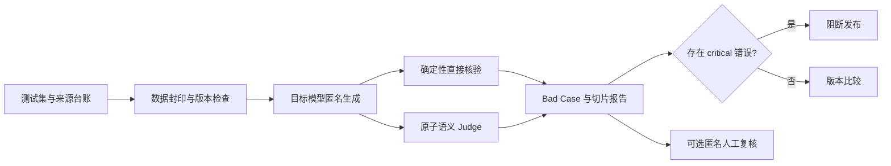

# Minos Bench：大模型质量评测工作台

[](LICENSE)
[](pyproject.toml)
[](SECURITY.md)

**Minos Bench（米诺斯审判台）**是一个本地优先、BYOK、可复现的 LLM 应用质量评测工作台。它把测试集、确定性核验、原子 Rubric、LLM Judge、Bad Case 归因、版本比较和人工复核放进同一条可追溯链路。

适合用来评测 Prompt、RAG、对话应用和工具调用 Agent。每个结论都能回到具体题目、评分项、证据和运行记录，而不只留下一个总分。

## 核心能力

| 能力 | 说明 |
|---|---|
| 多模型统一接入 | 通过 LiteLLM 接入 OpenAI-compatible Responses、Anthropic Messages 和其他 Provider |
| 双层自动评测 | JSON、字段、参数、调用顺序等由程序直接核验；语义要求由匿名原子 Judge 逐项判断 |
| 可解释评分 | 每条 Rubric 单独返回 PASS、FAIL 或 ABSTAIN，并保留证据、原因和严重程度 |
| 严重错误门禁 | critical 错误独立阻断发布，不会被较高平均分抵消 |
| 可恢复执行 | 固定执行图、幂等重进和追加式恢复只补运行失败节点，不重复已成功调用 |
| 运行与质量分离 | 超时、空响应、接口错误不会伪装成内容 0 分；回答答错也不会重生成到通过 |
| 匿名比较 | Judge 与可选人工复核看不到目标模型、Prompt 和配置身份 |
| 中文可视化工作台 | 七个页面覆盖模型配置、数据来源、运行评测、结果比较、单题复核和人工抽检 |
| 本地凭据隔离 | Windows 使用当前用户 DPAPI，Key 与完整 Base URL 保存在仓库外且不在 UI 回显 |

## 快速开始

### Windows 一键启动

```powershell
git clone https://github.com/IIMovoMII/minos-bench.git
cd minos-bench
```

双击：

```text
启动评测工作台.cmd
```

启动器会检查锁定环境，按需同步依赖，然后在 `127.0.0.1` 打开 Streamlit 工作台。首次进入“模型配置”页，填写模型 ID、协议、Base URL、API Key 和思考强度即可。

| 模式 | 需要配置 | 用途 |
|---|---|---|
| 快速体验 | 1 个被测模型 + 1 个 Judge | 验证完整链路；三个目标槽位相同，不用于模型比较 |
| 完整四槽 | 候选模型 A、候选模型 B、弱基线、Judge | 验证四配置执行链；可信比较需另行使用通过有效性门禁的新题集 |

Key 与完整 Base URL 不会写入仓库。Windows 持久化配置使用当前用户 DPAPI，并保存在项目目录之外。

### 手动启动

需要 Python 3.11–3.13 和 [uv](https://docs.astral.sh/uv/)：

```powershell
uv sync --frozen --no-editable --link-mode copy
powershell.exe -NoProfile -ExecutionPolicy Bypass -File .\scripts\start_ui.ps1
```

## 工作方式



评测对象不是一个裸模型名，而是“模型 + Prompt + 生成参数 + 任务数据集”的版本化配置。运行前固定题集、评分规则和执行计划，运行后只允许恢复技术失败；已经成功生成的内容不会因为分数不好而被替换。

## 内置 Scientific v2 历史样例集

仓库保留 24 道合成题及其完整运行工件，由 **4 个任务包 × 每包 3 个风险格 × D2/D3 两档难度**组成：

| 任务包 | 覆盖风险 |
|---|---|
| 指令生成 | 多约束、优先级与禁止项、长上下文与注入干扰 |
| 有依据问答 | 多步证据、信息不足与拒答、反证冲突与引用 |
| 多轮对话 | 指令保持、隐含状态、版本修改与跨轮一致性 |
| 结构化输出与工具调用 | 状态依赖、参数归一化、缺失信息、副作用与最终状态 |

每个题目都登记来源、风险格、难度、允许证据、直接检查、语义 Rubric、正反例和严重程度。题型方法来自公开评测研究，具体场景由本项目重新编写。

2026-08-20 逐题复审确认：现有台账主要证明“参考了什么方法”，尚未逐题证明业务改写与官方任务、官方成功条件和官方评分器等价；部分直接检查与 Judge 还会误杀千分位、否定句、同义表达和无关格式。因此这 24 题现只用于展示执行、恢复、审计和评分失败复盘，**不再用于可信的模型能力比较**。完整题面见 [`FORMAL_BENCHMARK_BACKED_QUESTION_SET_V2.md`](docs/FORMAL_BENCHMARK_BACKED_QUESTION_SET_V2.md)，复审结论见 [`SCIENTIFIC_V2_VALIDITY_REAUDIT_20260820.md`](docs/SCIENTIFIC_V2_VALIDITY_REAUDIT_20260820.md)。

## 评分与发布门禁

- 适用的原子项满足记 1，失败记 0；ABSTAIN 不进入得分，同时降低判断覆盖率。
- 先计算单题，再在任务包内平均，最后对四个任务包等权汇总。
- JSON Schema、工具名、参数、调用顺序和最终状态优先由程序核验。
- 证据支持、拒答边界、反证处理等语义行为由单次匿名 Judge 逐项判断。
- Provider、解析和合同错误单独记录为运行错误，不计内容 0 分。
- 任何预登记 critical 错误都会触发发布阻断。

## 历史运行报告

仓库附带一份身份盲的 Scientific v2 历史机器报告，用于展示切片、Bad Case、运行错误分流和追加式恢复。下列数字已撤回模型比较效力，只用于定位历史工件：

| 匿名配置 | 历史机器分数 | 历史机器结论 |
|---|---:|---|
| 配置 A | 87.92 | critical 阻断 |
| 配置 B | 82.43 | critical 阻断 |
| 配置 C | 85.83 | critical 阻断 |
| 配置 D | 85.21 | critical 阻断 |

这份报告包含 24 道题 × 4 个配置产生的 96 份目标输出，以及 96 份合法 Judge 结果。200/200 节点、96/96 输出、96/96 合法 Judge 和 0 运行错误仍是工程事实；表中分数、排序、`critical` 计数和判断覆盖率不能作为模型能力、准确率或发布结论。

[查看身份盲机器报告](artifacts/scientific_v2/executions/scientific-v2-20260804-a-recovery-4/machine_final_report.json)

## 常用命令

### 离线验收

重建数据、校验封印、执行静态检查和完整离线测试，不加载模型配置，也不会请求真实 Provider：

```powershell
powershell.exe -NoProfile -ExecutionPolicy Bypass `
  -File .\scripts\run_scientific_offline_acceptance.ps1
```

只验证数据合同：

```powershell
.\scripts\run_cli.ps1 scientific-validate
```

### 运行有限真实矩阵

真实运行需要先在本机配置完整四槽，并提供新的执行编号：

```powershell
powershell.exe -NoProfile -ExecutionPolicy Bypass `
  -File .\scripts\run_scientific_v2.ps1 `
  -ExecutionId scientific-v2-YYYYMMDD-a
```

执行顺序固定为：离线门禁 → Provider 健康探针 → 目标生成 → 原子 Judge → 机器报告与匿名包。详细恢复规则和协议说明见[执行文档](docs/EXECUTION_HANDOFF_V1_20260802.md)。

## 工作台页面

1. **模型配置**：维护目标模型和 Judge 的协议、地址、凭据与思考强度。
2. **项目概览**：查看数据规模、历史运行和模型连接状态。
3. **数据与来源**：检查题目、用途、来源台账和切分边界。
4. **运行评测**：启动评测并查看节点进度与运行错误。
5. **结果与比较**：按任务包、风险格和版本比较结果。
6. **单题复核**：回到输入、证据、Rubric 和逐项判断定位 Bad Case。
7. **可选人工抽检**：在隐藏模型和 Judge 结论的条件下追加人工复核。

## 项目结构

```text
minos-bench/
├─ app.py                         # Streamlit 中文工作台
├─ configs/                       # 评测配置与冻结执行合同
├─ datasets/scientific_v2/        # 历史题集、来源台账、manifest 与 seal
├─ src/llm_eval_workbench/        # 执行、核验、Judge、恢复与报告
├─ scripts/                       # 一键启动、验收、矩阵与安全审计
├─ tests/                         # 离线测试
├─ artifacts/                     # 精确允许的身份盲公开报告
└─ docs/                          # 方法、题集、协议和发布文档
```

## 安全与隐私

- 真实 API Key、Token、Cookie、完整 Base URL、请求头和本地 profile 不得进入 Git。
- `.env*`、Streamlit secrets、证书、DPAPI 文件、日志、数据库和原始运行工件默认由 `.gitignore` 排除。
- UI 不回显 Key 与完整 Base URL；模型配置通过标准输入交给本地保存脚本。
- 默认服务只绑定 `127.0.0.1`，不提供公网多租户密钥托管。
- 目标 Provider 会收到对应题目输入；Judge 只收到题目证据、匿名回答和预登记语义项。

提交前先建立暂存候选，再运行脱敏审计。审计器只报告规则名、路径和行号，不显示命中的原文：

```powershell
git add -A
uv run --no-sync python .\scripts\audit_public_commit.py
```

完整说明见 [`SECURITY.md`](SECURITY.md)。

## 文档

| 文档 | 内容 |
|---|---|
| [一键启动与公开边界](docs/PUBLIC_RELEASE_AND_ONE_CLICK_20260819.md) | 环境、页面配置、DPAPI 与 Git 允许列表 |
| [Scientific v2 历史题集](docs/FORMAL_BENCHMARK_BACKED_QUESTION_SET_V2.md) | 24 道题、风险格、gold、反例与检查边界；当前不承担模型比较 |
| [Scientific v2 有效性复审](docs/SCIENTIFIC_V2_VALIDITY_REAUDIT_20260820.md) | 评分误杀、分数撤回、逐题来源门禁与零 Provider 重建顺序 |
| [科学评测实施方案](docs/SCIENTIFIC_EVALUATION_IMPLEMENTATION_PLAN_V3_APPROVED.md) | 产品原则、判断权限、执行矩阵和验收合同 |
| [有限执行与恢复](docs/EXECUTION_HANDOFF_V1_20260802.md) | 单次 Judge、重试、幂等恢复和停止条件 |
| [安全说明](SECURITY.md) | 凭据隔离、误提交处置和部署边界 |

## 参与贡献

欢迎提交 Issue 或 Pull Request。修改题集、Rubric、评分、Provider 协议或执行恢复逻辑时，请同步补充对应测试和文档，并先运行离线验收与公开提交审计。

## 开源许可

本项目采用 [MIT License](LICENSE)。第三方依赖、研究论文和引用资料仍遵循各自许可证；题集的外部方法来源与改编边界记录在逐题来源台账中。
