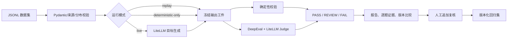

# Minos Bench：产品与实现说明

> 历史工程基线文档：本文主要描述 2026-07-30 的 40/8 + DeepEval G-Eval 版本，不再作为 Scientific v1 当前实现说明。当前请读项目 `README.md`、`PROJECT_SPEC.md` 和 `docs/PROJECT3_CURRENT_STATUS_20260802.md`；旧字段、阈值、页数和测试数仅作演进记录。

版本：1.0  
日期：2026-07-30  
定位：个人可复现的通用文本大模型评测 POC

## 1. 产品定义

Minos Bench 是一个把“感觉这个模型回答得好不好”转化为可重复评测流程的本地优先工作台。

它评测的对象不是一个抽象模型名，而是一份完整版本：

```text
目标模型 + Prompt + 生成参数 + 数据集 + 指标/Rubric + 实现代码
```

用户可以批量生成或导入输出，执行客观规则与 DeepEval 语义评估，查看单题证据和 Bad Case，对两个版本做同集比较，再把人工确认的问题加入版本化回归集。

## 2. 要解决的问题

大模型评测常见的四个问题是：

1. 只凭主观印象比较模型，结果无法复现。
2. 用一个统一总分评价不同任务，掩盖 JSON、事实性、多轮和工具调用之间的差异。
3. 把目标模型超时、Judge 失败和回答质量失败混在一起。
4. 只保存汇总分，不保留输入、输出、规则、原因和配置，之后无法解释为何通过或失败。

本产品的核心不是“让模型全部通过”，而是：

- 评测过程可重复；
- 结果能回到逐题证据；
- 工程错误与质量问题分离；
- 模糊问题保留人工判断；
- 已确认问题可以回归。

## 3. 用户与场景

目标用户：

- 大模型评测、数据运营或质检人员；
- AI 产品经理、产品测试或项目人员；
- 需要比较模型或 Prompt 的个人开发者。

典型场景：

- 同一 Prompt 下比较 Model A 与 Model B；
- 判断弱模型是否能通过更明确的 Prompt V2 得到部分补偿；
- 修改 Rubric 或阈值后，对冻结输出离线复评；
- 定位某一类 JSON、幻觉、多轮约束或 Function Call Bad Case；
- 将人工确认的失败加入回归集，防止后续版本复发。

## 4. 核心产品决策

### 4.1 按任务选择指标

四个任务包对应四类真实交付物：

| 任务包 | 典型任务 | 确定性检查 | 语义检查 |
|---|---|---|---|
| 指令与文本生成 | 摘要、改写、指定格式 | 数量、长度、必需/禁止项、语言 | 任务专属 G-Eval Rubric |
| Grounded QA | 给定资料回答 | 必需事实、禁止臆造、证据不足表述 | 完整性、相关性、有依据性 |
| 多轮上下文 | 约束更新、信息保持 | 最新约束、明确事实、禁止补全 | 上下文保持和角色边界 |
| 结构化输出与 Function Call | JSON、工具选择与参数 | JSON Schema、字段值、工具名、参数、顺序 | 最终任务是否正确完成 |

首版语义基线统一由 task-specific G-Eval 执行，但每条用例的 Rubric 不同。DeepEval 的 Faithfulness、Answer Relevancy 等专项指标保留为后续可选项，不把尚未实现的专项指标算作当前功能。

### 4.2 硬规则与 Judge 分工

可被程序明确判定的事项交给确定性代码：

- JSON 能否解析；
- Schema、字段类型和固定值；
- 是否恰好三项；
- 是否出现禁止事实；
- 工具名称、参数和顺序。

只有相关性、完整性、表达质量和证据支持程度等语义问题交给 Judge。

这样做的原因是：能确定的内容不应交给概率模型裁决；但开放语义也不适合全部压成关键词。

### 4.3 Judge 不是最终真值

当前工程基线使用一个固定 Judge，不做双 Judge 投票，并通过三种方式验证链路：

1. 固定 Judge、Rubric、阈值和温度；
2. 对固定校准子集重复评分三次，记录最大—最小差；
3. 候选人对 8 条 holdout 做盲审，完成后才计算三态一致率。

Judge 低分只能进入 `REVIEW`，不能单独制造硬 `FAIL`。客观硬规则失败或人工确认失败才进入 `FAIL`。

这不是最终科学测评模型。Judge 数量、Rubric、阈值、重复策略和人工校准必须等候选人先从第一性原理确定目的与误判成本后共同冻结。

### 4.4 不默认计算统一总分

工作台默认展示任务包、状态、单项指标和 Bad Case，不把所有任务压成一个总分。模型在 JSON 上很好、事实性上较差时，一个平均分会掩盖真实风险。

### 4.5 生成与评测解耦

目标输出先冻结，再执行评测：

- `live`：重新调用目标模型并评分；
- `replay`：固定目标输出，只重新运行确定性检查和 Judge；
- `deterministic-only`：固定输出，只运行本地硬规则。

离线复评是通用工程做法，因为修改 Rubric 或排查 Judge 时，不应让目标模型重新采样导致变量同时变化。

## 5. 端到端流程



每条输出和结果都是追加式写入。中途超时不会覆盖已完成题目；最终工件包含数据、生成、指标、配置和代码哈希。

## 6. 具体自动化了什么

工作台自动完成：

1. 批量读取 JSONL 并验证 Schema、来源和主数据分布。
2. 按配置渲染 Prompt，批量调用目标模型。
3. 对 Function Call 模拟工具回传并完成第二次模型调用。
4. 执行 JSON、字段、关键词、数量、语言和工具调用等硬规则。
5. 调用固定 Judge，保存分数、原因、重复评分和使用量。
6. 把运行错误和模型质量问题分开。
7. 按任务包聚合状态、调用量、Token 和 Provider 报告的费用。
8. 对两个兼容运行逐题标记改善、退化、不变或不可比较。
9. 导出 JSON、CSV、Markdown 和完整性清单。
10. 将人工确认的失败提升为新版本回归集，保留父版本和来源运行。

人工仍负责：

- 定义评测目标；
- 选择样本与来源；
- 设计 Rubric、阈值和致命项；
- 判断语义争议；
- 确认根因和优化建议；
- 决定模型是否满足具体业务要求。

因此准确的提效表述是：“把重复执行、硬规则检查、结果汇总、版本对齐和留证做成批量工作流”，而不是“完全自动代替人工评测”。当前没有测量节省工时或 ROI。

## 7. 主要功能与实现

| 功能 | 用户看到的结果 | 主要实现 |
|---|---|---|
| 数据校验 | 数量、任务、分组、语言、来源和哈希 | `dataset_service.py` + Pydantic |
| Provider 配置 | 只显示非敏感项和是否配置，不显示 Key/完整 URL | 当前用户 DPAPI profile + 进程环境 + `SecretStr` |
| 目标生成 | 文本和工具调用输出 | LiteLLM `aresponses`，`store=false`、非流式 |
| 有限重试 | 可追踪真实尝试次数 | 工作台显式重试，LiteLLM 隐式重试关闭 |
| 硬规则 | 单题通过/失败和原因 | 自定义 deterministic metrics |
| 语义评估 | 分数、阈值、原因和稳定性 | DeepEval `GEval` + 项目 Responses Judge 适配 + 目标身份盲评 |
| 三态裁决 | PASS / REVIEW / FAIL | `evaluator.py` |
| 运行工件 | manifest、outputs、results、summary | 追加式 JSONL + 原子 JSON |
| 完整性 | 文件 SHA-256 与重新验证 | `integrity.json` + `verify` |
| 版本比较 | 改善、退化、不变、不可比较 | `case_id` 对齐 + 配置兼容门禁 |
| 人工复核 | 结论、分类、原因、建议 | 追加式 `reviews.jsonl` |
| 回归提升 | `regression_vNNN.jsonl` | 只接受最新人工 FAIL |
| 演示界面 | 五个 Streamlit 页面 | 与 CLI 共用服务层 |

## 8. 状态路由

```text
调用/配置/数据/评测程序失败
  -> RUNTIME_ERROR

确定性硬规则失败
  -> FAIL

硬规则通过，但 Judge 低于阈值、重复评分波动或无有效分数
  -> REVIEW

硬规则通过，Judge 达标且稳定
  -> PASS

人工可追加 PASS / FAIL / NEEDS_MORE_EVIDENCE
  -> 不覆盖机器原记录
```

## 9. 版本比较如何保持公平

- Model A 与 Model B 使用同一 40 条数据、Prompt V1、温度、max tokens、Judge 和 Rubric，属于相对公平的模型对比。
- 较弱模型使用 Prompt V2，研究的是“更明确提示能补偿多少”，不是纯模型排名。
- 修改目标模型、Prompt 或生成参数后必须重新生成。
- 只修改 Judge、Rubric 或阈值时，可以对同一输出 `replay`。
- 数据集哈希不同则拒绝比较；指标哈希不同则抑制 Judge 分数差。

## 10. 安全、隐私与失败安全

- API Key 与完整 Base URL 只以当前用户 DPAPI 密文持久化，运行时解密到当前进程。
- UI 只显示变量是否存在，不读取或回显值。
- Key、请求头和完整 Base URL 不写入 manifest、结果或报告。
- 在线请求只走 `/responses`，固定 `store=false`、`stream=false`；Base URL 只填写 API 前缀。
- Judge 输入不含目标模型名、运行别名、Prompt ID 或 Prompt 版本；这些身份只在本地评分后对齐。
- Provider 异常只保留异常类型或 HTTP 状态，不保存可能含凭据的原始错误消息。
- 每题输出和结果立即 `fsync`，中断时保留已完成记录。
- holdout 文件有独立哈希密封；执行必须显式 `--allow-holdout`。
- 人工改判和回归提升都是明确动作，历史记录不可覆盖。

## 11. 当前真实边界

已经完成：

- 40 条主数据合同和 1 条人工设计回归种子；
- 核心运行、评测、比较、复核、回归、报告和完整性链路；
- 46 项本地测试和五页 UI 冒烟；
- 目标、探针和 Judge 的 `/responses` 迁移、本地 HTTP 路径合同、原生 `reasoning.effort=max` 与 Chat 禁用；
- 完全离线的正确/错误夹具、重放和比较演示。

尚未完成：

- 候选人先定第一性原则、Codex补足细节并共同冻结科学测评模型；
- 迁移后的 Responses provider probe 与三组真实目标模型 + Judge 运行；
- 按共同方案执行 Judge 稳定性与人工校准；
- 候选人 8 条 holdout 盲审与一致率；
- 候选人亲自操作和约 10 分钟无稿答辩。

当前不能声称真实模型分数、真实一致率、真实效率提升、生产部署或真实用户规模。

## 12. 为什么这个项目适合评测/AI 产品岗位

它展示的重点不是训练算法，而是：

- 把模糊质量目标拆成任务、数据、Rubric 和硬规则；
- 理解自动评测的有效边界；
- 识别 Bad Case 并区分模型、Judge、数据和工程故障；
- 用轻量代码把重复流程自动化；
- 保持版本、证据和人工判断可追溯；
- 能向产品、算法和工程解释同一套结果。

这与真实评测岗位需要的产品理解、规则设计、数据意识、结果分析和跨团队闭环更接近。
